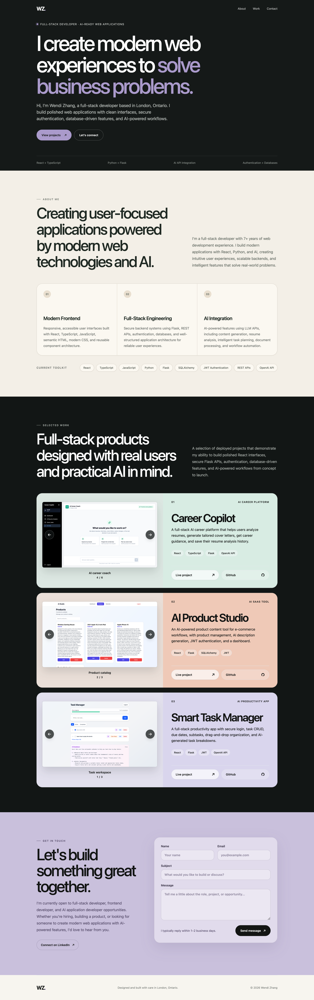

# 💼 Wendi Zhang Portfolio

A modern personal portfolio website showcasing my projects, skills, and experience as a Frontend Developer transitioning into AI-powered Full Stack Development.

Built with React, Vite, and Tailwind CSS.

---

## Live Website

https://wendi-zhang-portfolio-hoiqgoilw-wendizhang-5001s-projects.vercel.app

---

## Features

- Responsive design
- Smooth scrolling navigation
- Modern landing page
- About section
- Skills section
- Featured Projects
- Contact section
- Mobile-friendly layout

---

## Tech Stack

### Frontend

- React
- Vite
- Tailwind CSS
- JavaScript

### Deployment

- Vercel

---

## Screenshots

### Home



---

## Installation

Clone the repository

```bash
git clone https://github.com/WendiZhang/wendi-zhang-portfolio.git
```

Install dependencies

```bash
npm install
```

Run locally

```bash
npm run dev
```

Build production

```bash
npm run build
```